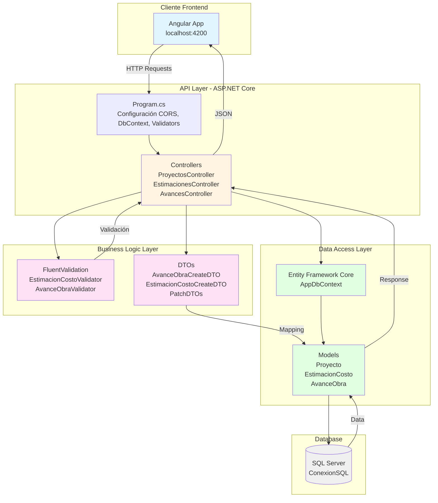
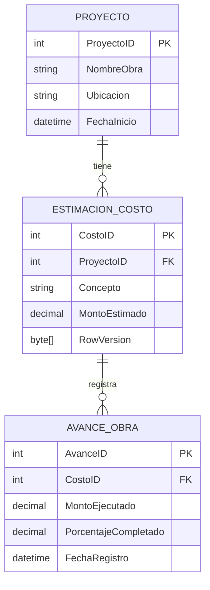
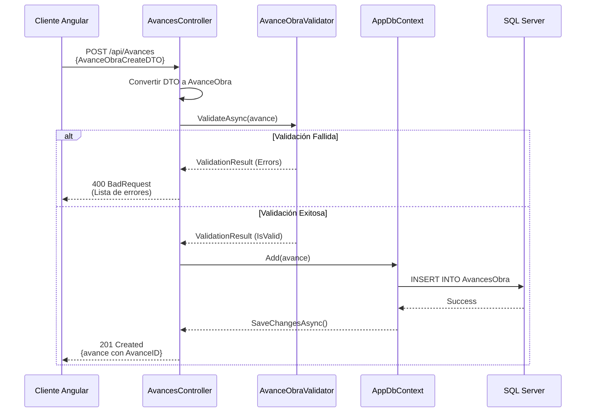
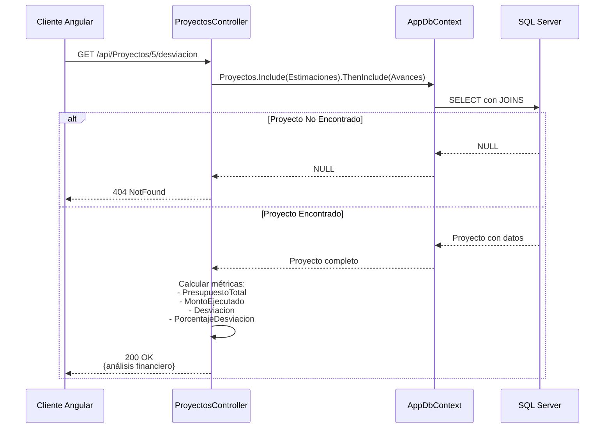
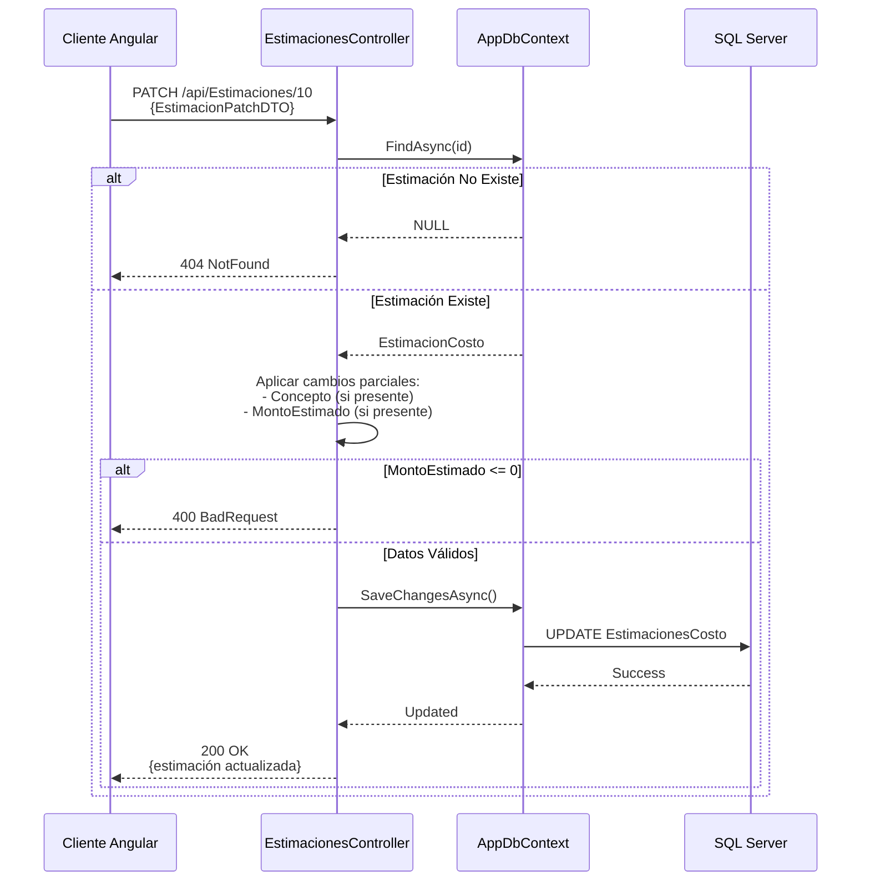
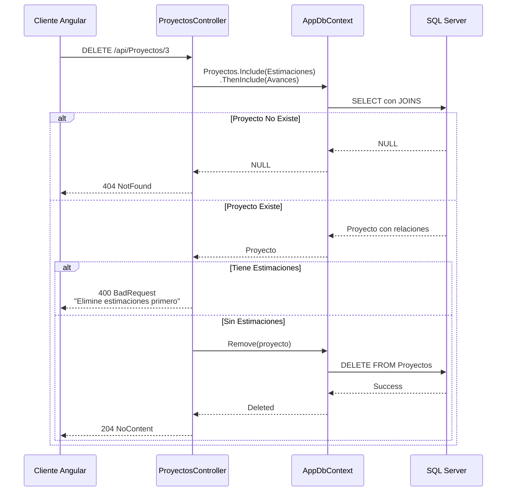
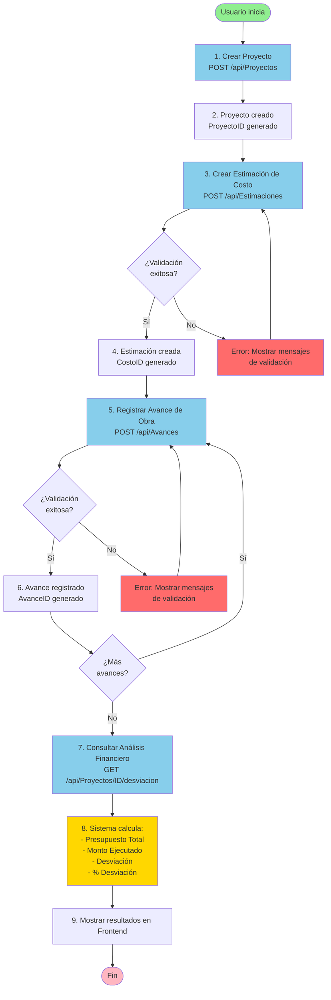
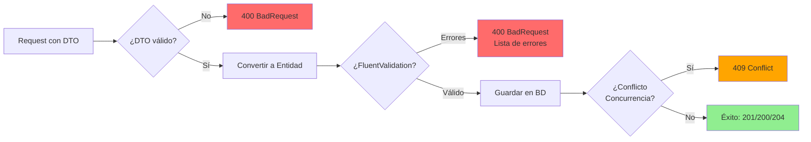

# Diagramas de Flujo - ControlObraApi

Este documento contiene los diagramas de flujo completos del proyecto **ControlObraApi**, una API RESTful para la gestión y seguimiento de proyectos de construcción.

## Tabla de Contenidos
- [1. Arquitectura General del Sistema](#1-arquitectura-general-del-sistema)
- [2. Modelo de Datos y Relaciones](#2-modelo-de-datos-y-relaciones)
- [3. Flujo de Datos por Endpoint](#3-flujo-de-datos-por-endpoint)
- [4. Flujo Completo del Sistema](#4-flujo-completo-del-sistema)

---

## 1. Arquitectura General del Sistema

Este diagrama muestra la arquitectura en capas de la aplicación:

---

## 2. Modelo de Datos y Relaciones

Este diagrama muestra las entidades del sistema y sus relaciones:

**Relaciones:**
- Un `Proyecto` puede tener **muchas** `EstimacionCosto`
- Una `EstimacionCosto` puede tener **muchos** `AvanceObra`
- Cada `AvanceObra` pertenece a **una** `EstimacionCosto`

---

## 3. Flujo de Datos por Endpoint

### 3.1 Flujo: Crear Avance de Obra (POST /api/Avances)

### 3.2 Flujo: Obtener Análisis Financiero (GET /api/Proyectos/{id}/desviacion)

### 3.3 Flujo: Actualización Parcial (PATCH /api/Estimaciones/{id})

### 3.4 Flujo: Eliminar Proyecto con Validación (DELETE /api/Proyectos/{id})

---

## 4. Flujo Completo del Sistema

Este diagrama muestra el flujo de trabajo completo desde la creación de un proyecto hasta el análisis de desviación:

---

## Endpoints Disponibles

### **Proyectos** (`/api/Proyectos`)
| Método | Ruta | Descripción |
|--------|------|-------------|
| GET | `/api/Proyectos` | Listar todos los proyectos |
| GET | `/api/Proyectos/{id}` | Obtener proyecto con estimaciones |
| POST | `/api/Proyectos` | Crear nuevo proyecto |
| PUT | `/api/Proyectos/{id}` | Actualización completa |
| PATCH | `/api/Proyectos/{id}` | Actualización parcial |
| DELETE | `/api/Proyectos/{id}` | Eliminar proyecto |
| GET | `/api/Proyectos/{id}/desviacion` | **Análisis financiero** |

### **Estimaciones** (`/api/Estimaciones`)
| Método | Ruta | Descripción |
|--------|------|-------------|
| GET | `/api/Estimaciones/{id}` | Obtener estimación con avances |
| POST | `/api/Estimaciones` | Crear nueva estimación |
| PUT | `/api/Estimaciones/{id}` | Actualización completa |
| PATCH | `/api/Estimaciones/{id}` | Actualización parcial |
| DELETE | `/api/Estimaciones/{id}` | Eliminar estimación |

### **Avances** (`/api/Avances`)
| Método | Ruta | Descripción |
|--------|------|-------------|
| GET | `/api/Avances` | Listar todos los avances |
| GET | `/api/Avances/{id}` | Obtener avance específico |
| POST | `/api/Avances` | Registrar nuevo avance |
| PUT | `/api/Avances/{id}` | Actualización completa |
| PATCH | `/api/Avances/{id}` | Actualización parcial |
| DELETE | `/api/Avances/{id}` | Eliminar avance |
| GET | `/api/Avances/porEstimacion/{costoId}` | Avances por estimación |

---

## Características Técnicas

### **1. CORS Configuration**
- Permitido: `http://localhost:4200` (Angular)
- Headers: Cualquiera
- Métodos: Cualquiera

### **2. Base de Datos**
- **Motor**: SQL Server
- **ORM**: Entity Framework Core
- **Optimización**: Split Query Behavior (evita cartesian explosion)

### **3. Validación**
- **FluentValidation** para lógica de negocio
- Validaciones aplicadas antes de guardar en BD

### **4. Serialización JSON**
- **Newtonsoft.Json** 
- `ReferenceLoopHandling.Ignore` (evita ciclos en relaciones)

### **5. Optimistic Concurrency**
- Campo `RowVersion` en `EstimacionCosto`
- Detecta modificaciones concurrentes

### **6. DTOs**
- **Create DTOs**: Para inserción (sin IDs)
- **Patch DTOs**: Para actualización parcial (campos opcionales)

---

## Flujo de Validaciones

---

## Notas Importantes

> [!IMPORTANT]
> **Optimistic Concurrency**: La tabla `EstimacionCosto` usa `RowVersion` para Control de Concurrencia Optimista. Si dos usuarios modifican la misma estimación simultáneamente, el segundo recibirá un error 409.

> [!WARNING]
> **Eliminación en Cascada**: Para eliminar un `Proyecto`, primero deben eliminarse todas sus `Estimaciones`. Para eliminar una `Estimación`, primero deben eliminarse todos sus `Avances`.

> [!TIP]
> **Análisis Financiero**: El endpoint `/api/Proyectos/{id}/desviacion` calcula automáticamente la desviación presupuestal comparando el presupuesto total con los montos ejecutados.

---

**Fecha de Generación**: 2025-11-21  
**Versión API**: ASP.NET Core con Entity Framework Core  
**Base de Datos**: SQL Server
