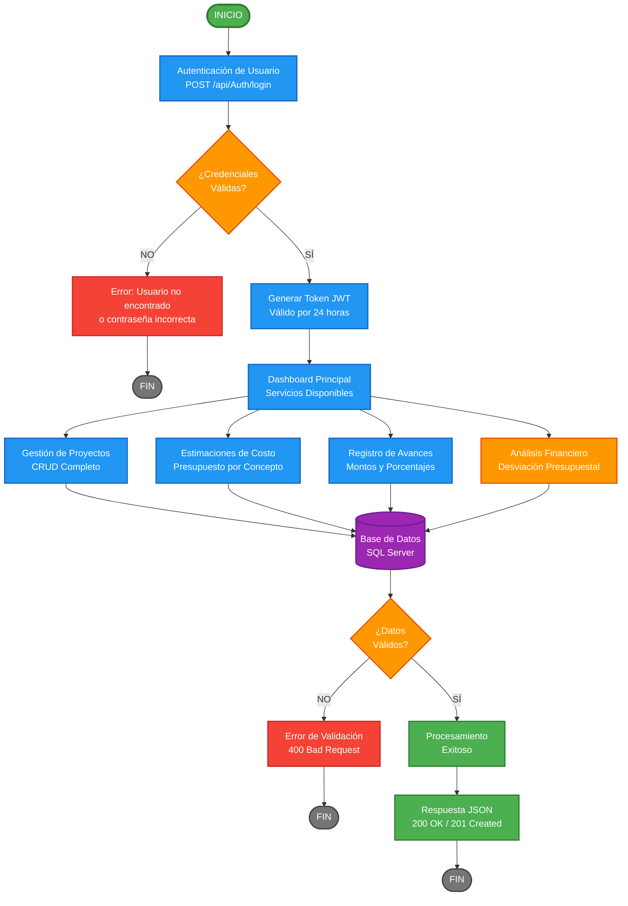

# 🏗️ ControlObraApi

> Sistema integral de gestión y control de proyectos de construcción - API RESTful

[](https://dotnet.microsoft.com/)
[](https://www.microsoft.com/sql-server)
[](https://jwt.io/)

---

## 📋 Tabla de Contenidos

- [Descripción](#-descripción)
- [Características Principales](#-características-principales)
- [Tecnologías Utilizadas](#-tecnologías-utilizadas)
- [Diagrama de Flujo](#-diagrama-de-flujo-del-sistema)
- [Requisitos Previos](#-requisitos-previos)
- [Instalación](#-instalación)
- [Configuración](#-configuración)
- [Ejecución](#-ejecución)
- [Documentación de Endpoints](#-documentación-de-endpoints)
- [Ejemplos de Uso en Postman](#-ejemplos-de-uso-en-postman)
- [Estructura del Proyecto](#-estructura-del-proyecto)
- [Modelos de Datos](#-modelos-de-datos)

---

## 🎯 Descripción

**ControlObraApi** es una API RESTful desarrollada en ASP.NET Core que permite a empresas constructoras, contratistas y gestores de proyectos administrar de manera eficiente todas las fases de una obra de construcción, desde la planificación inicial hasta el seguimiento de avances y el análisis financiero.

### Problema que Soluciona

- ✅ **Centralización de datos**: Unifica información de proyectos, presupuestos y avances
- ✅ **Visibilidad financiera**: Análisis automático de desviaciones presupuestales
- ✅ **Control de avances**: Seguimiento detallado del progreso físico y financiero
- ✅ **Seguridad**: Autenticación JWT para protección de datos sensibles
- ✅ **Validación de datos**: Integridad garantizada mediante FluentValidation

---

## ✨ Características Principales

1. **🔐 Autenticación y Autorización**
   - Registro de usuarios con encriptación BCrypt
   - Login con generación de tokens JWT
   - Tokens válidos por 24 horas

2. **📊 Gestión de Proyectos**
   - CRUD completo de proyectos de construcción
   - Registro de información clave (nombre, ubicación, fecha)
   - Consulta con estimaciones y avances asociados

3. **💰 Administración de Presupuestos**
   - Creación de estimaciones de costos por concepto
   - Actualización parcial (PATCH) o completa (PUT)
   - Validación automática de montos y conceptos

4. **📈 Seguimiento de Avances**
   - Registro de avances físicos (% completado)
   - Registro de montos ejecutados
   - Consulta de avances por estimación

5. **🎯 Análisis de Desviación Financiera (Endpoint Diferenciador)**
   - Cálculo automático de desviaciones presupuestales
   - Proyección de costo final basado en avance físico
   - Clasificación de riesgo: BAJO, MEDIO, ALTO

---

## 🛠️ Tecnologías Utilizadas

| Tecnología | Versión | Propósito |
|-----------|---------|-----------|
| ASP.NET Core | 8.0 | Framework principal |
| Entity Framework Core | 8.0 | ORM para base de datos |
| SQL Server | 2019+ | Base de datos relacional |
| JWT | - | Autenticación y autorización |
| BCrypt.Net | - | Encriptación de contraseñas |
| FluentValidation | - | Validación de modelos |
| Swagger/OpenAPI | - | Documentación interactiva |

---

## 📊 Diagrama de Flujo del Sistema



---

## 📦 Requisitos Previos

Antes de comenzar, asegúrate de tener instalado:

- [.NET SDK 8.0+](https://dotnet.microsoft.com/download)
- [SQL Server 2019+](https://www.microsoft.com/sql-server) o SQL Server Express
- [Postman](https://www.postman.com/downloads/) (para pruebas de API)
- [Visual Studio 2022](https://visualstudio.microsoft.com/) o [VS Code](https://code.visualstudio.com/) (opcional)

---

## 🚀 Instalación

### 1️⃣ Clonar el Repositorio

```bash
git clone https://github.com/tu-usuario/ControlObraApi.git
cd ControlObraApi/ControlObraApi
```

### 2️⃣ Restaurar Paquetes NuGet

```bash
dotnet restore
```

### 3️⃣ Verificar las Dependencias

El proyecto incluye automáticamente las siguientes dependencias:

```xml
<PackageReference Include="Microsoft.EntityFrameworkCore" Version="8.0.x" />
<PackageReference Include="Microsoft.EntityFrameworkCore.SqlServer" Version="8.0.x" />
<PackageReference Include="Microsoft.EntityFrameworkCore.Tools" Version="8.0.x" />
<PackageReference Include="BCrypt.Net-Next" Version="4.0.x" />
<PackageReference Include="FluentValidation.AspNetCore" Version="11.3.x" />
<PackageReference Include="Microsoft.AspNetCore.Authentication.JwtBearer" Version="8.0.x" />
<PackageReference Include="Swashbuckle.AspNetCore" Version="6.5.x" />
```

---

## ⚙️ Configuración

### 1️⃣ Configurar SQL Server

Edita el archivo `appsettings.json` con tus credenciales de SQL Server:

```json
{
  "ConnectionStrings": {
    "ConexionSQL": "Server=localhost,1433;Database=ControlObraDB;User Id=sa;Password=TU_PASSWORD;TrustServerCertificate=True"
  },
  "AppSettings": {
    "Token": "my super secret key for jwt token generation that is long enough"
  },
  "AllowedHosts": "*"
}
```

> ⚠️ **Importante**: Reemplaza `TU_PASSWORD` con tu contraseña de SQL Server.

### 2️⃣ Crear la Base de Datos

```bash
dotnet ef database update
```

Este comando ejecutará las migraciones y creará:
- Base de datos `ControlObraDB`
- Tablas: `Users`, `Proyectos`, `EstimacionesCosto`, `AvancesObra`

### 3️⃣ Verificar la Conexión

Si tienes problemas de conexión, verifica:
- SQL Server está corriendo
- El puerto 1433 está abierto
- Las credenciales son correctas
- La autenticación SQL Server está habilitada

---

## ▶️ Ejecución

### Opción 1: Usando Visual Studio

1. Abre `ControlObraApi.sln`
2. Presiona `F5` o `Ctrl + F5`
3. La API se ejecutará en `https://localhost:7xxx` y `http://localhost:5xxx`

### Opción 2: Usando .NET CLI

```bash
dotnet run
```

La API estará disponible en:
- **HTTPS**: `https://localhost:7135`
- **HTTP**: `http://localhost:5135`
- **Swagger**: `https://localhost:7135/swagger`

---

## 📚 Documentación de Endpoints

> [!IMPORTANT]
> **🔐 AUTENTICACIÓN JWT REQUERIDA**
> 
> Todos los endpoints excepto `/api/Auth/register` y `/api/Auth/login` requieren un token JWT válido en el header de autorización.
> 
> ```http
> Authorization: Bearer {tu_token_jwt}
> ```
> 
> **Pasos para autenticarte:**
> 1. Registra un usuario con `POST /api/Auth/register` O inicia sesión con `POST /api/Auth/login`
> 2. Copia el token de la respuesta
> 3. Incluye el token en el header `Authorization: Bearer {token}` en todas las peticiones a endpoints protegidos
> 4. El token es válido por 24 horas

---

### 🔐 **Autenticación**

> [!NOTE]
> Los endpoints de autenticación son **públicos** y no requieren token.

#### `POST /api/Auth/register` - Registrar Usuario

Crea un nuevo usuario en el sistema.

**Request Body:**
```json
{
  "name": "Miguel Rodríguez",
  "email": "miguel@constructora.com",
  "password": "MiPassword123!"
}
```

**Response (201 Created):**
```json
{
  "token": "eyJhbGciOiJIUzUxMiIsInR5cCI6IkpXVCJ9...",
  "user": {
    "userId": 1,
    "name": "Miguel Rodríguez",
    "email": "miguel@constructora.com",
    "username": "miguel",
    "role": "User"
  }
}
```

---

#### `POST /api/Auth/login` - Iniciar Sesión

Autentica un usuario y genera un token JWT.

**Request Body:**
```json
{
  "email": "miguel@constructora.com",
  "password": "MiPassword123!"
}
```

**Response (200 OK):**
```json
{
  "token": "eyJhbGciOiJIUzUxMiIsInR5cCI6IkpXVCJ9..."
}
```

---

### 🏗️ **Proyectos**

> [!WARNING]
> **Todos los endpoints de Proyectos requieren autenticación JWT.**
> 
> Incluye el header: `Authorization: Bearer {tu_token}`

#### `GET /api/Proyectos` - Listar Todos los Proyectos

Obtiene todos los proyectos con sus estimaciones.

**Response (200 OK):**
```json
[
  {
    "proyectoID": 1,
    "nombreObra": "Torre Residencial Bosques",
    "ubicacion": "Av. Insurgentes 1234, CDMX",
    "fechaInicio": "2025-01-15T00:00:00",
    "estimaciones": [...]
  }
]
```

---

#### `GET /api/Proyectos/{id}` - Obtener Proyecto por ID

Obtiene un proyecto específico con todas sus estimaciones y avances.

**Response (200 OK):**
```json
{
  "proyectoID": 1,
  "nombreObra": "Torre Residencial Bosques",
  "ubicacion": "Av. Insurgentes 1234, CDMX",
  "fechaInicio": "2025-01-15T00:00:00",
  "estimaciones": [
    {
      "costoID": 1,
      "concepto": "Excavación y Cimentación",
      "montoEstimado": 450000.00,
      "avances": [...]
    }
  ]
}
```

---

#### `POST /api/Proyectos` - Crear Proyecto

Crea un nuevo proyecto de construcción.

**Request Body:**
```json
{
  "nombreObra": "Centro Comercial Norte",
  "ubicacion": "Boulevard Norte 5678, Monterrey",
  "fechaInicio": "2025-02-01T00:00:00"
}
```

**Response (201 Created):**
```json
{
  "proyectoID": 2,
  "nombreObra": "Centro Comercial Norte",
  "ubicacion": "Boulevard Norte 5678, Monterrey",
  "fechaInicio": "2025-02-01T00:00:00",
  "estimaciones": []
}
```

---

#### `PUT /api/Proyectos/{id}` - Actualizar Proyecto Completo

Actualiza todos los campos de un proyecto.

**Request Body:**
```json
{
  "proyectoID": 1,
  "nombreObra": "Torre Residencial Bosques (Actualizado)",
  "ubicacion": "Av. Insurgentes 1234, CDMX",
  "fechaInicio": "2025-01-20T00:00:00"
}
```

**Response (204 No Content)**

---

#### `PATCH /api/Proyectos/{id}` - Actualizar Proyecto Parcial

Actualiza solo los campos especificados.

**Request Body:**
```json
{
  "nombreObra": "Torre Residencial Bosques"
}
```

**Response (200 OK):**
```json
{
  "proyectoID": 1,
  "nombreObra": "Torre Residencial Bosques",
  "ubicacion": "Av. Insurgentes 1234, CDMX",
  "fechaInicio": "2025-01-15T00:00:00"
}
```

---

#### `DELETE /api/Proyectos/{id}` - Eliminar Proyecto

Elimina un proyecto (solo si no tiene estimaciones).

**Response (204 No Content)**

**Response Error (400 Bad Request):**
```json
{
  "error": "No se puede eliminar el proyecto",
  "razon": "El proyecto tiene estimaciones de costo asociadas. Elimínelas primero.",
  "estimacionesCount": 3
}
```

---

#### `GET /api/Proyectos/Desviacion/{id}` - 🎯 Análisis de Desviación (Endpoint Diferenciador)

Calcula la desviación financiera de un proyecto.

**Response (200 OK):**
```json
{
  "riesgoDesviacion": "ALTO",
  "desviacionPorcentaje": 12.50,
  "costoEstimado": 2000000.00,
  "costoProyectadoFinal": 2250000.00,
  "mensaje": "El proyecto tiene un avance físico promedio del 45.00%."
}
```

**Clasificación de Riesgo:**
- **BAJO**: Desviación ≤ 0% (dentro o por debajo del presupuesto)
- **MEDIO**: Desviación entre 0% y 5%
- **ALTO**: Desviación > 5%

---

### 💰 **Estimaciones de Costo**

> [!WARNING]
> **Todos los endpoints de Estimaciones requieren autenticación JWT.**
> 
> Incluye el header: `Authorization: Bearer {tu_token}`

#### `POST /api/Estimaciones` - Crear Estimación

Crea una nueva estimación de costo para un proyecto.

**Request Body:**
```json
{
  "concepto": "Instalaciones Eléctricas",
  "montoEstimado": 350000.00,
  "proyectoID": 1
}
```

**Response (201 Created):**
```json
{
  "costoID": 3,
  "concepto": "Instalaciones Eléctricas",
  "montoEstimado": 350000.00,
  "proyectoID": 1
}
```

---

#### `GET /api/Estimaciones/{id}` - Obtener Estimación

Obtiene una estimación específica con sus avances.

**Response (200 OK):**
```json
{
  "costoID": 1,
  "concepto": "Excavación y Cimentación",
  "montoEstimado": 450000.00,
  "proyectoID": 1,
  "avances": [...]
}
```

---

#### `PUT /api/Estimaciones/{id}` - Actualizar Estimación Completa

**Request Body:**
```json
{
  "costoID": 1,
  "concepto": "Excavación y Cimentación Actualizada",
  "montoEstimado": 500000.00,
  "proyectoID": 1
}
```

**Response (204 No Content)**

---

#### `PATCH /api/Estimaciones/{id}` - Actualizar Estimación Parcial

**Request Body:**
```json
{
  "montoEstimado": 480000.00
}
```

**Response (200 OK):**
```json
{
  "costoID": 1,
  "concepto": "Excavación y Cimentación",
  "montoEstimado": 480000.00,
  "proyectoID": 1
}
```

---

#### `DELETE /api/Estimaciones/{id}` - Eliminar Estimación

Elimina una estimación (solo si no tiene avances).

**Response (204 No Content)**

**Response Error (400 Bad Request):**
```json
{
  "error": "No se puede eliminar la estimación",
  "razon": "La estimación tiene avances de obra registrados. Elimínelos primero.",
  "avancesCount": 2
}
```

---

### 📈 **Avances de Obra**

> [!WARNING]
> **Todos los endpoints de Avances requieren autenticación JWT.**
> 
> Incluye el header: `Authorization: Bearer {tu_token}`

#### `POST /api/Avances` - Registrar Avance

Registra un nuevo avance de obra.

**Request Body:**
```json
{
  "montoEjecutado": 120000.00,
  "porcentajeCompletado": 35.5,
  "costoID": 1
}
```

**Response (201 Created):**
```json
{
  "avanceID": 1,
  "montoEjecutado": 120000.00,
  "porcentajeCompletado": 35.5,
  "fechaRegistro": "2025-11-23T17:30:00",
  "costoID": 1
}
```

---

#### `GET /api/Avances/{id}` - Obtener Avance

Obtiene un avance específico.

**Response (200 OK):**
```json
{
  "avanceID": 1,
  "montoEjecutado": 120000.00,
  "porcentajeCompletado": 35.5,
  "fechaRegistro": "2025-11-23T17:30:00",
  "costoID": 1,
  "estimacionCosto": {...}
}
```

---

#### `GET /api/Avances` - Listar Todos los Avances

Obtiene todos los avances registrados.

**Response (200 OK):**
```json
[
  {
    "avanceID": 1,
    "montoEjecutado": 120000.00,
    "porcentajeCompletado": 35.5,
    "fechaRegistro": "2025-11-23T17:30:00",
    "costoID": 1
  }
]
```

---

#### `GET /api/Avances/porEstimacion/{costoId}` - Avances por Estimación

Obtiene todos los avances de una estimación específica.

**Response (200 OK):**
```json
[
  {
    "avanceID": 1,
    "montoEjecutado": 120000.00,
    "porcentajeCompletado": 35.5,
    "fechaRegistro": "2025-11-23T17:30:00",
    "costoID": 1
  }
]
```

---

#### `PUT /api/Avances/{id}` - Actualizar Avance Completo

**Request Body:**
```json
{
  "avanceID": 1,
  "montoEjecutado": 150000.00,
  "porcentajeCompletado": 45.0,
  "fechaRegistro": "2025-11-23T17:30:00",
  "costoID": 1
}
```

**Response (204 No Content)**

---

#### `PATCH /api/Avances/{id}` - Actualizar Avance Parcial

**Request Body:**
```json
{
  "porcentajeCompletado": 50.0
}
```

**Response (200 OK):**
```json
{
  "avanceID": 1,
  "montoEjecutado": 150000.00,
  "porcentajeCompletado": 50.0,
  "fechaRegistro": "2025-11-23T17:30:00",
  "costoID": 1
}
```

---

#### `DELETE /api/Avances/{id}` - Eliminar Avance

Elimina un avance de obra.

**Response (204 No Content)**

---

## 🧪 Ejemplos de Uso en Postman

### ⚙️ Configuración de JWT en Postman

> [!TIP]
> **Configurar el Token Globalmente en Postman**
> 
> Para no tener que copiar el token manualmente en cada petición:
> 
> 1. **Crea una Variable de Entorno:**
>    - En Postman, ve a `Environments` → `Create Environment`
>    - Nombra tu ambiente (ej: "ControlObra Local")
>    - Agrega una variable: `jwt_token` (sin valor inicial)
>    - Guarda el ambiente
> 
> 2. **Configura la Autenticación a Nivel de Colección:**
>    - Crea o edita tu colección "ControlObraApi"
>    - Ve a la pestaña `Authorization`
>    - Selecciona `Type: Bearer Token`
>    - En el campo Token escribe: `{{jwt_token}}`
>    - Guarda los cambios
> 
> 3. **Guarda el Token Automáticamente al Hacer Login:**
>    - En la petición `POST /api/Auth/login`
>    - Ve a la pestaña `Tests`
>    - Agrega este script:
>      ```javascript
>      var jsonData = pm.response.json();
>      pm.environment.set("jwt_token", jsonData.token);
>      ```
>    - Ahora cada vez que hagas login, el token se guardará automáticamente
> 
> 4. **Usa el Ambiente:**
>    - Selecciona tu ambiente "ControlObra Local" en el dropdown superior derecho
>    - Todas las peticiones protegidas usarán automáticamente el token

---

### Flujo Completo de Pruebas

#### 1️⃣ Registrar Usuario

```
POST https://localhost:7135/api/Auth/register
Content-Type: application/json

{
  "name": "Juan Pérez",
  "email": "juan@test.com",
  "password": "Test123!"
}
```

**Guardar el token** de la respuesta para usarlo en las siguientes peticiones.

---

#### 2️⃣ Iniciar Sesión (si ya tienes usuario)

```
POST https://localhost:7135/api/Auth/login
Content-Type: application/json

{
  "email": "juan@test.com",
  "password": "Test123!"
}
```

---

#### 3️⃣ Crear un Proyecto (🔐 Requiere Token)

```
POST https://localhost:7135/api/Proyectos
Content-Type: application/json
Authorization: Bearer {TU_TOKEN_AQUI}

{
  "nombreObra": "Edificio Corporativo",
  "ubicacion": "Av. Principal 123",
  "fechaInicio": "2025-01-01T00:00:00"
}
```

**Guardar el `proyectoID`** de la respuesta.

---

#### 4️⃣ Crear Estimaciones de Costo (🔐 Requiere Token)

```
POST https://localhost:7135/api/Estimaciones
Content-Type: application/json
Authorization: Bearer {TU_TOKEN_AQUI}

{
  "concepto": "Excavación",
  "montoEstimado": 100000.00,
  "proyectoID": 1
}
```

Repite para crear más estimaciones (ej: "Estructura", "Acabados").

**Guardar el `costoID`** de cada estimación.

---

#### 5️⃣ Registrar Avances de Obra (🔐 Requiere Token)

```
POST https://localhost:7135/api/Avances
Content-Type: application/json
Authorization: Bearer {TU_TOKEN_AQUI}

{
  "montoEjecutado": 25000.00,
  "porcentajeCompletado": 25.0,
  "costoID": 1
}
```

---

#### 6️⃣ Consultar Desviación Financiera (🔐 Requiere Token)

```
GET https://localhost:7135/api/Proyectos/Desviacion/1
Authorization: Bearer {TU_TOKEN_AQUI}
```

Esta petición te mostrará el análisis de riesgo del proyecto.

---

#### 7️⃣ Listar Todos los Proyectos (🔐 Requiere Token)

```
GET https://localhost:7135/api/Proyectos
Authorization: Bearer {TU_TOKEN_AQUI}
```

---

### 📦 Colección de Postman

Puedes importar esta colección base:

```json
{
  "info": {
    "name": "ControlObraApi",
    "schema": "https://schema.getpostman.com/json/collection/v2.1.0/collection.json"
  },
  "item": [
    {
      "name": "Auth",
      "item": [
        {
          "name": "Register",
          "request": {
            "method": "POST",
            "header": [],
            "body": {
              "mode": "raw",
              "raw": "{\n  \"name\": \"Test User\",\n  \"email\": \"test@test.com\",\n  \"password\": \"Test123!\"\n}",
              "options": { "raw": { "language": "json" } }
            },
            "url": "{{baseUrl}}/api/Auth/register"
          }
        },
        {
          "name": "Login",
          "request": {
            "method": "POST",
            "header": [],
            "body": {
              "mode": "raw",
              "raw": "{\n  \"email\": \"test@test.com\",\n  \"password\": \"Test123!\"\n}",
              "options": { "raw": { "language": "json" } }
            },
            "url": "{{baseUrl}}/api/Auth/login"
          }
        }
      ]
    }
  ],
  "variable": [
    {
      "key": "baseUrl",
      "value": "https://localhost:7135"
    }
  ]
}
```

---

## 📁 Estructura del Proyecto

```
ControlObraApi/
│
├── Controllers/
│   ├── AuthController.cs          # Autenticación (register, login)
│   ├── ProyectosController.cs     # CRUD proyectos + análisis desviación
│   ├── EstimacionesController.cs  # CRUD estimaciones de costo
│   └── AvancesController.cs       # CRUD avances de obra
│
├── Models/
│   ├── AppDbContext.cs           # Contexto de Entity Framework
│   ├── User.cs                   # Modelo de usuario
│   ├── Proyecto.cs               # Modelo de proyecto
│   ├── EstimacionCosto.cs        # Modelo de estimación
│   └── AvanceObra.cs             # Modelo de avance
│
├── DTOs/
│   ├── RegisterDto.cs            # DTO para registro
│   ├── LoginDto.cs               # DTO para login
│   ├── ProyectoPatchDTO.cs       # DTO para actualización parcial proyecto
│   ├── EstimacionCostoCreateDTO.cs
│   ├── EstimacionPatchDTO.cs
│   ├── AvanceObraCreateDTO.cs
│   └── AvancePatchDTO.cs
│
├── Validators/
│   ├── EstimacionCostoValidator.cs
│   └── AvanceObraValidator.cs
│
├── Migrations/
│   └── [Archivos de migración automáticos]
│
├── Program.cs                    # Configuración principal
├── appsettings.json             # Configuración de la app
└── ControlObraApi.csproj        # Archivo de proyecto
```

---

## 🗄️ Modelos de Datos

### User
```csharp
{
  UserId: int (PK),
  Name: string,
  Email: string (unique),
  Username: string,
  PasswordHash: string,
  Role: string
}
```

### Proyecto
```csharp
{
  ProyectoID: int (PK),
  NombreObra: string,
  Ubicacion: string,
  FechaInicio: DateTime,
  Estimaciones: ICollection<EstimacionCosto>
}
```

### EstimacionCosto
```csharp
{
  CostoID: int (PK),
  Concepto: string,
  MontoEstimado: decimal(18,2),
  ProyectoID: int (FK),
  RowVersion: byte[],
  Avances: ICollection<AvanceObra>
}
```

### AvanceObra
```csharp
{
  AvanceID: int (PK),
  MontoEjecutado: decimal(18,2),
  PorcentajeCompletado: decimal(5,2),
  FechaRegistro: DateTime,
  CostoID: int (FK)
}
```

---

## 🐛 Solución de Problemas Comunes

### Error: "No se puede conectar a SQL Server"

1. Verifica que SQL Server esté corriendo
2. Revisa el puerto en la cadena de conexión
3. Verifica las credenciales
4. Asegúrate que la autenticación SQL está habilitada

### Error: "Database does not exist"

```bash
dotnet ef database update
```

### Error: "Authentication failed"

Revisa que `TrustServerCertificate=True` esté en la cadena de conexión.

---

## 📝 Notas Importantes

- Los tokens JWT expiran en **24 horas**
- Las contraseñas se encriptan con **BCrypt**
- La validación de datos usa **FluentValidation**
- Los endpoints usan **restricciones de ruta** (`{id:int}`)
- Se implementa **Optimistic Concurrency** con `RowVersion`

---

## 📄 Licencia

Este proyecto fue desarrollado con fines académicos.

---

## 👨‍💻 Autor

**[Miguel Angel Diaz Rivera]**  
Sistemas Propietarios 
Fecha: Noviembre 2025

---

